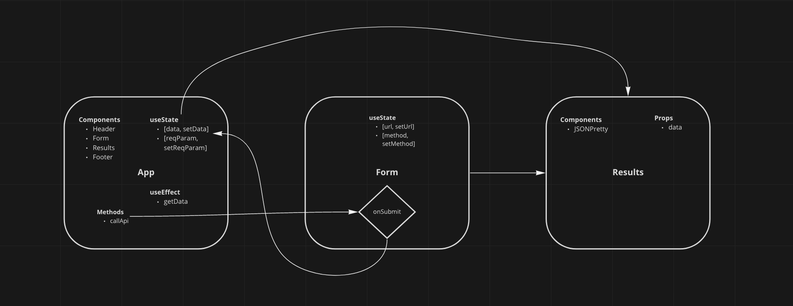
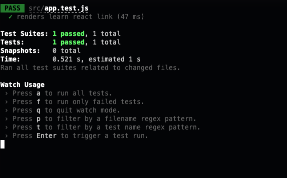
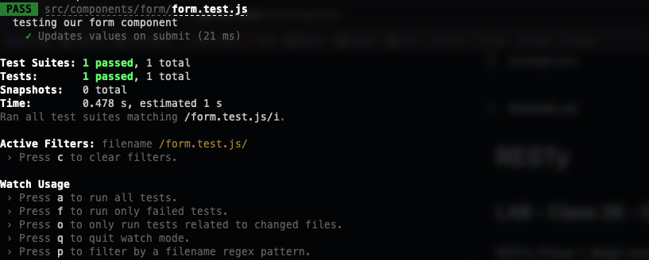

# RESTy

## Deployment

[Production](https://gudt-resty.herokuapp.com/)

## About

- RESTy is a browser based API testing tool. Give the deployment link a click, and enter in your favorite API's!

## Author

- Dylan Ullrich

## Process

- RESTy is a four phase project that started with a refactor of class components to function components (FC). This means we are now using Hooks rather than utilizing props/state with class component architecture.
- After establishing FC/Hooks, RESTy was set up to mock API calls, and display them styled appropriately utilizing SASS.
- Once the desired look was achieved, Axios was utilized to conduct API calls and present data with React JSON Pretty.
- Test coverage for app.js, and form.js.

### UML

### Testing and Validation

#### app.test.js

#### form.test.js

